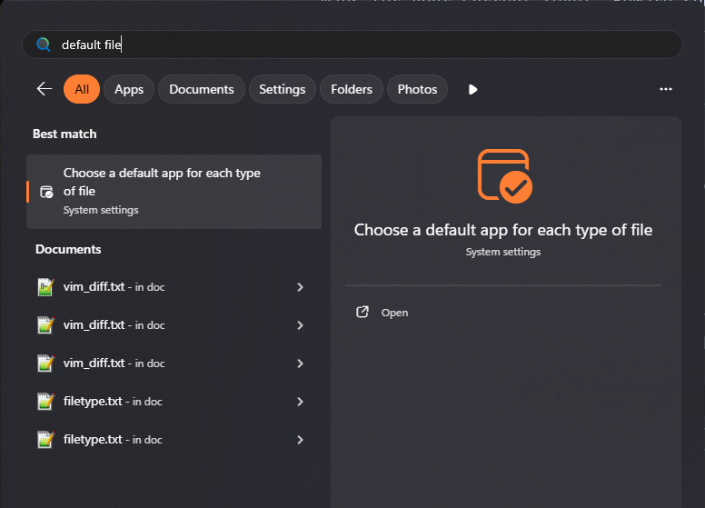
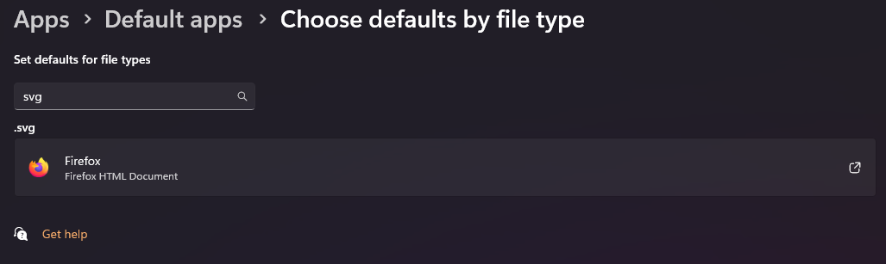

# GTFO_MapGeneration

This project is used to generate maps either before a run or to see where item spawns are.

This is in theory the true successor of WardenMapper. Kind of.

## What can it do:

1. Render maps that contain all resource spawns, some important items, cells and maybe a few other things.
2. Build insanely fast container/cell maps.

## How to setup:

1. Download the project as a ZIP file and unzip it where you want to have it.
2. Install Python
3. Open a CMD in the project root folder
4. Run either `py -m pip install -r requirements.txt` or `pip install -r requirements.txt` (first method via `py` launcher is preferrable on windows 10/11)

If this command fails make sure pip installed and the environment variables are set for both Python and pip.

## How to generate container/cell maps

1. Open a CMD in the project root folder.
2. Run `py -m src.show_containers <level_name>` or `python -m src.show_containers <level_name>`

Optionally you can directly specify a marker set hash and with these tags u can set which things are shown:

| Argument | Effect |
| --- | --- |
| -h | shows the help message |
| -c | disables showing containers, these are enabled by default |
| -s | shows small pickups |
| -b | shows big pickups |
| -t [TEXT_SIZE] | change the text size |  
| -i | Hide images and just put the text where the container is |  

## How to generate resource maps for ur current level

This works by reading the game's log file with your current level and seed. Similar to Foresight in Logger.

1. Open a CMD in the project root folder.
2. Run `py -m src.main` or `python -m src.main`

From now on the app runs in the background and awaits for you to press the hotkey `ctrl-shift-a` to generate the maps for your current level. Beware some specific stuff is not shown properly. You may still need to use the Logger to see which key is for which door in some levels or terminals, hsus etc.

Optionally you can also customize the exact behaviour of this:

| Argument | Effect |
| --- | --- |
| -h | shows the help message |
| -k HOTKEY | modify the hotkey to whatever you want |
| -a | automatically render the maps when a seed is found, beware if you are resetting a lot it might cause issues with performance |
| -r | stop the app from automatically reopening the generated map every time, it will open it only once and you will have to manually refresh your tab |
| -d DIMENSION_ID | only render a specific dimension, useful for levels like r8e2 where only 1 dimension is useful while 3 exist |
| -s | use an automatically updating server - try it out as it might be the best |
| --ip | ip used by the server, default is "127.0.0.1" which does not allow external connections AT ALL. "0.0.0.0" does if u want to use your phone to view it |
| -p | port used by the server, default is 8000 |

I really recommend using `-a` only with `-r` as `-r` allows u to just refresh the browser tab you want.

Also `-s` will automatically enable automatic rendering as the server itself updates the data automatically. 

### Issues
I: Sometimes pressing hotkey `Ctrl-Shift-A` does not open the file in browser or the dialog.\
S: Make sure your default app for `svg` file extension is set to your preferred image viewer (default windows/IrfanView or your preferred browser)
> Screenshots provided for `Win 11`.

### Credits
- The better looking icons are made by RandomKenny
